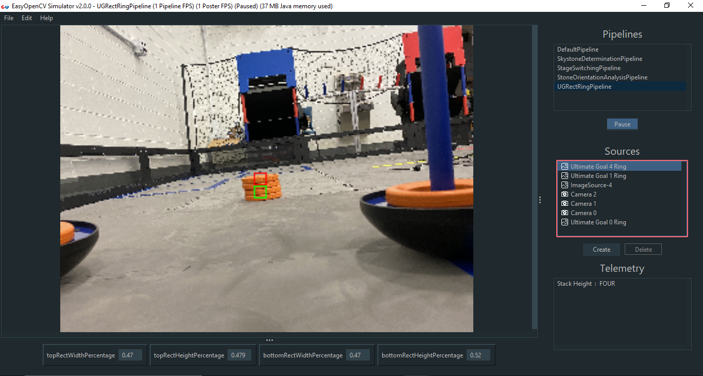

# Welcome!

Thank you for your interest in EOCV-Sim! \(EasyOpenCV Simulator\)

We made this tool in hopes that it will be useful for all FTC teams seeking a way of learning and developing their seasonal OpenCV algorithms in an easy and straightforward way, while also providing some extra tools to improve the experience of developing such algorithms.

The main purpose of this software is to simulate the package & class structure of [OpenFTC's EasyOpenCV](https://github.com/OpenFTC/EasyOpenCV) and a little bit of the FTC SDK, while also providing OpenCV functionality and a simple GUI.

By simulating the aforementioned structure, it allows the imports, class names, etc. to be the same as they would be if you were using the FTC SDK with EasyOpenCV, allowing you to simply copy and paste your vision code into your Android Studio project once you want to transfer it to a robot.

  
While the main focus of this software is the FIRST Tech Challenge competition, nothing stops you from using it to solve any sort of general purpose computer vision problem :\). We highly encourage people to use it as a learning tool outside of FTC, for any sort of project. 

We are also welcome to suggestions if you see anything that could be added or improved! [GitHub Issues](https://github.com/deltacv/EOCV-Sim/issues) are open to suggestions and bug reports.

