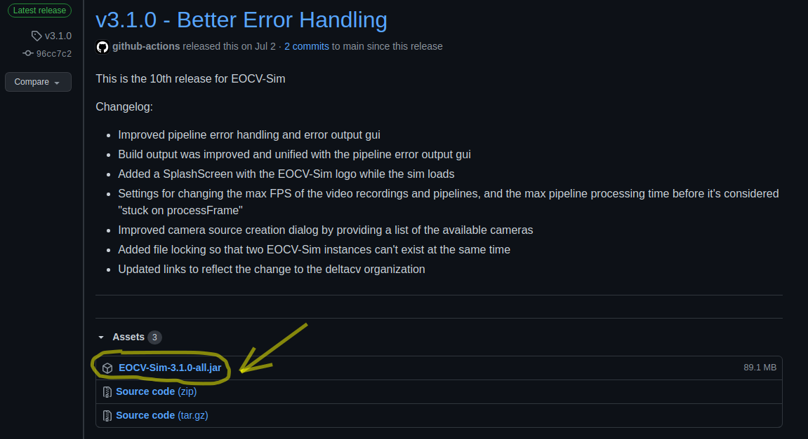

# Downloading EOCV-Sim

1. **Download and install the Java Development Kit if you haven't already:**  
  
JDK 8 is the minimum. Any JDK above that version will most likely work fine. You can download it from [the Oracle webpage](https://www.oracle.com/java/technologies/javase-downloads.html), and here is a [step by step video](https://www.youtube.com/watch?v=IJ-PJbvJBGs) of the installation process

**2.** [**Click on this link** ](https://github.com/deltacv/EOCV-Sim/releases/latest)**to go to the latest release in the EOCV-Sim GitHub repo.**

**3.** **Download the jar file, named `EOCV-Sim-X.X.X-all.jar`, available at the bottom on the "assets" section:**



Note that the screenshot might not be what is actually displayed when you open the page. As new releases come out, this will differ from what you see. But you will always be able to find a jar file in the assets section of any release, similar to the screenshot.

## Running EOCV-Sim

Once the jar file has finished downloading, you can simply double click it in your operating system file explorer to run it, just like any other executable file.

If this doesn't work, you can try running it from the command line. First navigate to the folder the EOCV-Sim jar is stored using the `cd` command. Then, invoke the java command passing it the jar name as follows:

```text
java -jar "EOCV-Sim-X.X.X-all.jar"
```

Replacing the X.X.X by the version respectively, e.g 3.1.0

If this doesn't work either, make sure to open a [GitHub issue](https://github.com/deltacv/EOCV-Sim/issues/new/choose) explaining your problem. It would help us a lot to improve :\)

