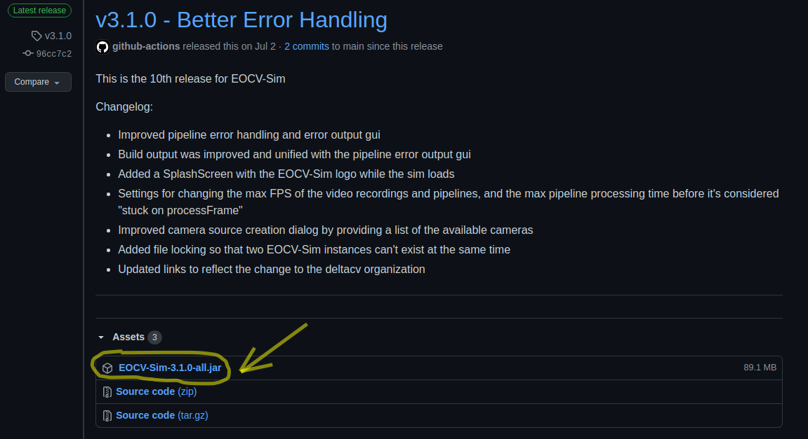

# Downloading EOCV-Sim

**1. Download and install the Java Runtime Environment or Java Development Kit if you haven't already:** &#x20;

EOCV-Sim requires Java 11 at minimum. Any newer version should work fine. You can download it from [the Oracle webpage](https://www.oracle.com/java/technologies/javase-downloads.html).

**2.** [**Click on this link** ](https://github.com/deltacv/EOCV-Sim/releases/latest)**to go to the latest release in the EOCV-Sim GitHub repo.**

**3.** **Download the jar file, named `EOCV-Sim-X.X.X-all.jar`, available at the bottom on the "assets" section:**



_(Note that the screenshot might not be what is actually displayed when you open the page, as new releases_ come ou&#x74;_. The EOCV-Sim-all artifact shall always be available to download from any release)_

## Running EOCV-Sim

Once the jar file is downloaded, you can simply double-click it to run it, just like any other executable file.

You can also run the jar file from the command line.&#x20;

Navigate to the folder where the EOCV-Sim jar is stored in, using the `cd` command. Then, invoke the java command passing the file name as follows:

```
java -jar "EOCV-Sim-X.X.X-all.jar"
```

Replacing the X.X.X by the version respectively, e.g 3.1.0

## Interested in PaperVision? [Click here to go back to the documentation page.](https://app.gitbook.com/s/Fmz3GSY1piwyk8EqDogS/installing-papervision)
