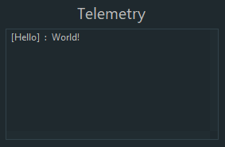

# Telemetry

It's sometimes useful to log data from your pipeline to know the result in real time. To do this, we partially implement the basic Telemetry interface that is present in the FTC SDK \(e.g methods like `Telemetry#talk`are not implemented\) to follow the main idea of EOCV-Sim of "easily copy-pasting into an FTC SDK project".

To use telemetry in a pipeline, you need to have a constructor which takes a Telemetry parameter, and save it into an instance variable. This is demostrated in the following code:

```java
import org.opencv.core.Mat;
import org.openftc.easyopencv.OpenCvPipeline;

import org.firstinspires.ftc.robotcore.external.Telemetry;

public class TelemetryPipeline extends OpenCvPipeline {

    Telemetry telemetry;

    public TelemetryPipeline(Telemetry telemetry) {
        this.telemetry = telemetry;
    }

    @Override
    public Mat processFrame(Mat input) {
        telemetry.addData("[Hello]", "World!");
        telemetry.update();
        return input; // Return the input mat
    }

}
```



The basic idea of telemetry is to send data using `Telemetry#addData` or `Telemetry#addLine`. Once you finish adding data, you call `Telemetry#update` in the end, to display the data and clear the past state of the telemetry so the messages that were sent in a previous call to update will not be displayed.

