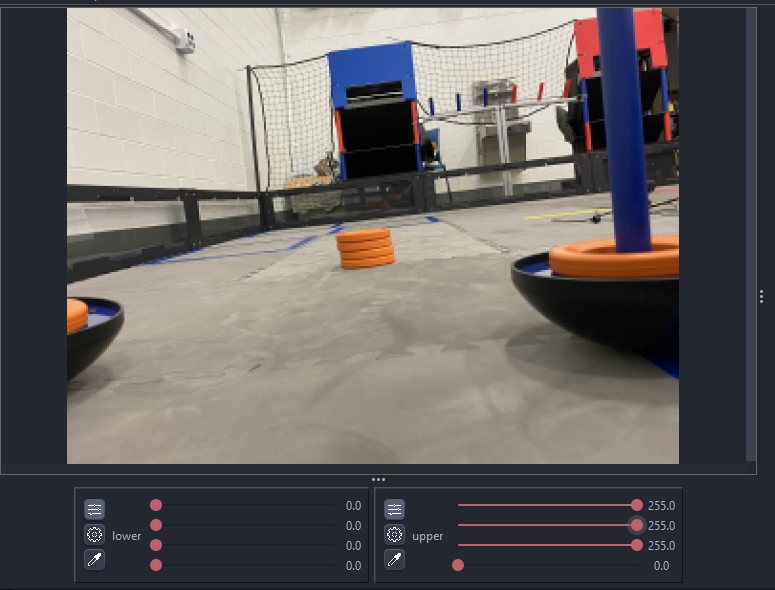
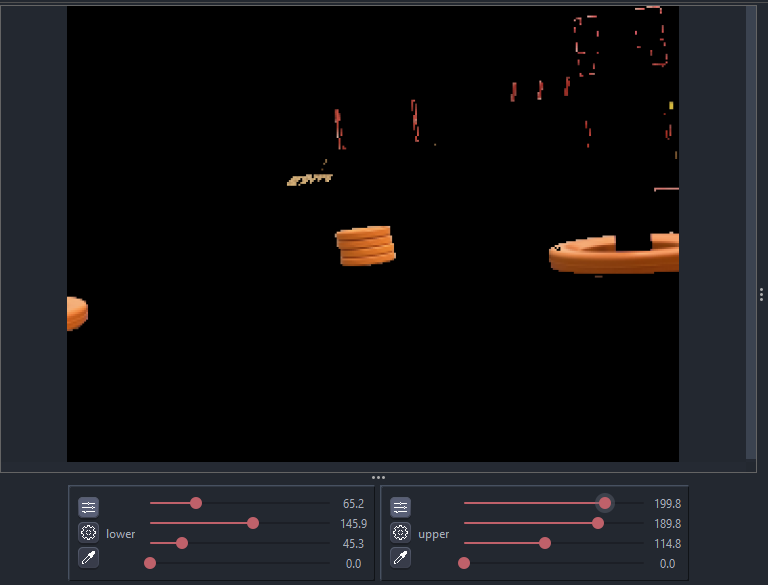

# Variable Tuner

## Sample Usage

Let's say we need to tune a threshold for finding the ring stack in the 2020-2021 "Ultimate Goal" game. For this, we will use the YCrCb color space since it's one of the most used ones in FTC and it behaves better under different lightning conditions. \(see [this article](https://learnopencv.com/color-spaces-in-opencv-cpp-python/) for more extended explaination and comparation of different color spaces\).

We can write a simple pipeline for achieving this, taking advantage of the variable tuner. Here's an example code with detailed comments:

```java
package org.firstinspires.ftc.teamcode;

import org.opencv.core.Core;
import org.opencv.core.Mat;
import org.opencv.core.Scalar;
import org.opencv.imgproc.Imgproc;
import org.openftc.easyopencv.OpenCvPipeline;

public class SimpleThresholdPipeline extends OpenCvPipeline {

    /*
     * These are our variables that will be
     * modifiable from the variable tuner.
     *
     * Scalars in OpenCV are generally used to
     * represent color. So our values in the
     * lower and upper Scalars here represent
     * the Y, Cr and Cb values respectively.
     *
     * YCbCr, like most color spaces, range
     * from 0-255, so we default to those
     * min and max values here for now, meaning
     * that all pixels will be shown.
     */
    public Scalar lower = new Scalar(0, 0, 0);
    public Scalar upper = new Scalar(255, 255, 255);

    /*
     * A good practice when typing EOCV pipelines is
     * declaring the Mats you will use here at the top
     * of your pipeline, to reuse the same buffers every
     * time. This removes the need to call mat.release()
     * with every Mat you create on the processFrame method,
     * and therefore, reducing the possibility of getting a
     * memory leak and causing the app to crash due to an
     * "Out of Memory" error.
     */
    private Mat ycrcbMat       = new Mat();
    private Mat binaryMat      = new Mat();
    private Mat maskedInputMat = new Mat();

    @Override
    public Mat processFrame(Mat input) {
        /*
         * Converts our input mat from RGB to YCrCb.
         * EOCV ALWAYS returns RGB mats, so you'd
         * always convert from RGB to the color
         * space you want to use.
         *
         * Takes our "input" mat as an input, and outputs
         * to a separate Mat buffer "ycrcbMat"
         */
        Imgproc.cvtColor(input, ycrcbMat, Imgproc.COLOR_RGB2YCrCb);

        /*
         * This is where our thresholding actually happens.
         * Takes our "ycrcbMat" as input and outputs a "binary"
         * Mat to "binaryMat" of the same size as our input.
         * "Discards" all the pixels outside the bounds specified
         * by the scalars above (and modifiable with EOCV-Sim's
         * live variable tuner.)
         *
         * Binary meaning that we have either a 0 or 255 value
         * for every pixel.
         *
         * 0 represents our pixels that were outside the bounds
         * 255 represents our pixels that are inside the bounds
         */
        Core.inRange(ycrcbMat, lower, upper, binaryMat);

        /*
         * Release the reusable Mat so that old data doesn't
         * affect the next step in the current processing
         */
        maskedInputMat.release();

        /*
         * Now, with our binary Mat, we perform a "bitwise and"
         * to our input image, meaning that we will perform a mask
         * which will include the pixels from our input Mat which
         * are "255" in our binary Mat (meaning that they're inside
         * the range) and will discard any other pixel outside the
         * range (RGB 0, 0, 0. All discarded pixels will be black)
         */
        Core.bitwise_and(input, input, maskedInputMat, binaryMat);

        /*
         * The Mat returned from this method is the
         * one displayed on the viewport.
         *
         * To visualize our threshold, we'll return
         * the "masked input mat" which shows the
         * pixel from the input Mat that were inside
         * the threshold range.
         */
        return maskedInputMat;
    }

}
```

And so, when initially selecting this pipeline in the simulator, it's initial state should look something like this:



All pixels from the input Mat are visible entirely, this is because we specified a range of 0 lower and 255 upper \(0-255\) for all three channels \(see the sliders values\). Since those values are the minimum \(0%\) and maximum \(100%\) for YCrCb respectively, all pixels are able to go through our "threshold". The last slider can be ignored since we don't have a 4th color channel

After a bit of playing around with the sliders, it's possible to come up with some decent values which successfully filter out the orange ring stack out of everything else:



A problem with the YCrCb color space, especially this year, is that the difference between red and orange is very subtle. So therefore we need to play with the values for a good while until we find some that filters out the red from the goals \(in the image you can see there's still red leftovers at the top right\) but displays the ring stack. Or do some other technique alongside thresholding such as [FTCLib's contour ring pipeline](https://github.com/FTCLib/FTCLib/blob/3a43b191b18581a2f741588f9b8ab60c13b7fb6c/core/vision/src/main/java/com/arcrobotics/ftclib/vision/UGContourRingPipeline.kt#L46) with the "horizon" mechanism.

To keep this explaination simple, you can find the final pipeline [here](https://github.com/serivesmejia/EOCV-Sim/blob/dev/TeamCode/src/main/java/org/firstinspires/ftc/teamcode/SimpleThresholdPipeline.java) with the some additional features, in the TeamCode module, since serves as a good sample alongside other sample classes from EOCV itself.


