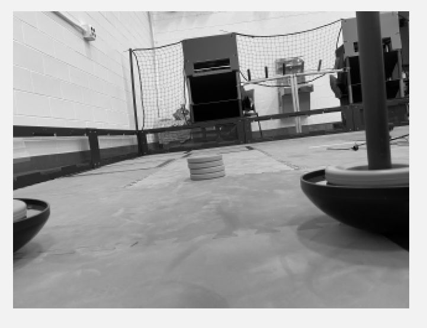

# EasyOpenCV Pipelines

## What is a pipeline?

A pipeline is essentially an encapsulation of OpenCV image processing to do a certain thing. Most of the time, image processing requires operations to be done in series instead of in parallel; outputs from step A are fed into the inputs of step B, and outputs of step B are fed into step C, and so on. Hence, the term "Pipeline". `(definition extracted from the`[`EasyOpenCV docs`](https://github.com/OpenFTC/EasyOpenCV/blob/master/doc/user\_docs/pipelines\_overview.md)`)`

EasyOpenCV implements this idea by using an abstract `OpenCvPipeline` class, from which you will extend when making your own pipeline. For example, here we have a pipeline that doesn't do any processing with the input image:

```java
import org.opencv.core.Mat;
import org.openftc.easyopencv.OpenCvPipeline;

public class EmptyPipeline extends OpenCvPipeline {

    @Override
    public Mat processFrame(Mat input) {
        return input;
    }

}
```

The `processFrame` function that comes from the extended OpenCvPipeline class always needs to be overridden, and it is where all your vision processing magic will happen. This function will be called when a new frame is dispatched from the camera (or from a static image or a video file, in the case of EOCV-Sim).

An OpenCV `Mat` is simply a **mat**rix that contains any type of data, which for our purposes will be an image most of the time, and they are the base for OpenCV image processing.&#x20;

The Mat returned from processFrame function will be displayed on the live viewport. Since we are directly returning the input mat in the code before, the image coming from the camera will be displayed exactly as it is.

The most simple processing that can be done in OpenCV is changing an image's color space to another one. The following pipeline simply takes the input mat and changes its color space to grayscale:

```java
public class GrayPipeline extends OpenCvPipeline {

    @Override
    public Mat processFrame(Mat input) {
        Imgproc.cvtColor(input, input, Imgproc.COLOR_RGBA2GRAY);
        return input;
    }
}
```



One thing to note here is the conversion code used, `Imgproc.COLOR_RGBA2GRAY`, which means in a more literal way "convert the input mat,which is in the RGBA color space, to the grayscale space".

EasyOpenCV **ALWAYS** inputs RGBA frames to the pipeline (which stands for red, green, blue, alpha channels). This means that whenever you want to convert the input mat to another color space, you always need to specify to convert the mat from the RGBA color space to the desired one.&#x20;

For example, `Imgproc.COLOR_RGBA2RGB` (remove the alpha channel), `Imgproc.COLOR_RGB2HSV`, `Imgproc.COLOR_RGB2YCrCb`, etc.
