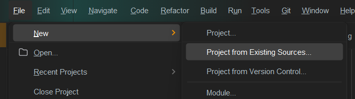

# OpModes in EOCV-Sim

To enable usage of the VisionPortal API within EOCV-Sim, newer versions of the simulator enable the usage of so-called "`OpMode`s"; [FIRST Tech Challenge teams should be already familiar with this concept](https://ftc-docs.firstinspires.org/en/latest/programming\_resources/tutorial\_specific/android\_studio/creating\_op\_modes/Creating-and-Running-an-Op-Mode-\(Android-Studio\).html#examining-the-structure-of-your-op-mode), where they work as "executable units" that allow users to write and run their custom robot code in a logical and simple manner, splitting robot operation into different "programs" that can be selected and switched to perfom different tasks depending on what is needed through the different stages of a robot match.

Due to the way VisionPortal works specifically, it is ideal to call this API within said `OpMode`s, where setup code tells the API which cameras to use, the resolution of the camera stream, whether we want a live preview or not, running multiple VisionProcessors at once, or even perform development and testing of AprilTag localization math within these executable units.

### Lifecycle

`OpMode`s have a very specific and simple flow of execution:

* The `init()` method which is executed when you press init after selecting the OpMode
* The `loop()` method which is executed repeatedly after `init()` has passed you press start
* The OpMode should be able to stop anytime when requested, pressing the stop button that is available right after starting.

<figure><figcaption><p>The OpMode selection and control panel as depicted in EOCV-Sim</p></figcaption></figure>

### OpMode Structure

Just like `OpenCvPipeline`, `OpMode` is a class that you can extend and inherit basic methods from:

```java
import com.qualcomm.robotcore.eventloop.opmode.OpMode;
import com.qualcomm.robotcore.eventloop.opmode.TeleOp;

/*
 * This contains an example of an iterative (Non-Linear) "OpMode".
 * An OpMode is a 'program' that runs in either the autonomous or the teleop period of an FTC match.
 * The names of OpModes appear on the menu of the FTC Driver Station.
 * When a selection is made from the menu, the corresponding OpMode
 * class is instantiated on the Robot Controller and executed.
 */
@TeleOp(name="Example OpMode")
public class ExampleOpMode extends OpMode {

    /*
     * Code to run ONCE when the driver hits INIT
     */
    @Override
    public void init() {
        telemetry.addData("Status", "Initialized");
    }

    /*
     * Code to run REPEATEDLY after the driver hits INIT, but before they hit PLAY
     */
    @Override
    public void init_loop() {
    }

    /*
     * Code to run ONCE when the driver hits PLAY
     */
    @Override
    public void start() {
    }

    /*
     * Code to run REPEATEDLY after the driver hits PLAY but before they hit STOP
     */
    @Override
    public void loop() {
    }

    /*
     * Code to run ONCE after the driver hits STOP
     */
    @Override
    public void stop() {
    }
}
```

#### `@Autonomous` vs `@TeleOp`

You might have noticed this particular declaration in the example code earlier, which are known as "annotations" within Java. In this specific case, this annotation helps the program find your custom-created `OpMode`s. The key difference between @Autonomous and @TeleOp simply consists of where your program will be classified within the user interface of the station controls;

<figure><figcaption></figcaption></figure>

Both annotations take a `name`parameter which aid in displaying a more user-friendly name for your `OpMode`s when selecting them;

<pre class="language-java"><code class="lang-java"><strong>@TeleOp(name = "Concept: AprilTag")
</strong></code></pre>

<figure><figcaption></figcaption></figure>

### LinearOpMode

LinearOpMode has a different structure than OpMode, but it is basically the same idea;

```java
@Autonomous(name="Example OpMode")
public class ExampleLinearOpMode extends LinearOpMode {

    @Override
    public void runOpMode() {
        telemetry.addData("Status", "Initialized");
        telemetry.update();
        
        // Wait for the game to start (driver presses PLAY)
        waitForStart();

        // run until the end of the match (driver presses STOP)
        while (opModeIsActive()) {
            telemetry.addData("Status", "Running");
            telemetry.update();
        }
    }
}
```

There is an overridden method called `runOpMode`. Every op mode of type`LinearOpMode` must implement this method, as it gets called when a user selects and initializes your OpMode within the UI. Note that all linear op modes should have a `waitForStart()` statement to ensure that the robot will not begin executing the op mode until the driver pushes the start button.

After a start command has been received, the op mode enters a while loop and keeps iterating in this loop until the op mode is no longer active (i.e., until the user pushes the stop button on the Driver Station).

