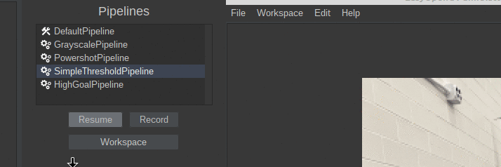

# Android Studio

**First, make sure you follow the** [**EasyOpenCV installation instructions**](https://github.com/OpenFTC/EasyOpenCV#installation-instructions) **to add OpenCV into your FTC SDK project!**

If you want to use EOCV-Sim with `OpenCvPipeline`s that are already in Android Studio, that's easily possible using the workspaces feature.

To achieve this, you need to isolate your pipeline's source files into their own package. Since EOCV-Sim only implements a very small part of the FTC SDK, if you try to compile a class that references stuff like `OpMode` or `DcMotor`, it will fail since those classes don't exist in EOCV-Sim.

The only classes from the FTC SDK and EasyOpenCV that have been implemented are...

<table>
  <thead>
    <tr>
      <th style="text-align:left">Package</th>
      <th style="text-align:left">Classes</th>
    </tr>
  </thead>
  <tbody>
    <tr>
      <td style="text-align:left">org.firstinspires.ftc.robotcore.external</td>
      <td style="text-align:left">
        
Telemetry (partially)

        
Func

      </td>
    </tr>
    <tr>
      <td style="text-align:left">org.firstinspires.ftc.robotcore.external.function</td>
      <td style="text-align:left">Consumer</td>
    </tr>
    <tr>
      <td style="text-align:left">com.qualcomm.robotcore.util</td>
      <td style="text-align:left">
        
ElapsedTime

        
MovingStatistics

        
Range

        
Statistics

      </td>
    </tr>
    <tr>
      <td style="text-align:left">org.openftc.easyopencv</td>
      <td style="text-align:left">
        
OpenCvPipeline

        
OpenCvTracker

        
OpenCvTrackerApiPipeline

        
TimestampedOpenCvPipeline

      </td>
    </tr>
    <tr>
      <td style="text-align:left">org.opencv</td>
      <td style="text-align:left">*<b> </b>(everything)</td>
    </tr>
  </tbody>
</table>

This also means that you **do not need to use the`OpenCvCamera`related stuff in EOCV-Sim**, inputs are simulated using [Input Sources](../features/input-sources.md).

For example, you can have the following package structure in your Android Studio project to isolate `OpenCvPipeline`s and load the into EOCV-Sim:

The `VisionTestOpMode`class can freely use any of the FTC SDK or EasyOpenCV classes, such as `OpMode`or`OpenCvCamera`, while the classes under the `vision`package should only use the ones specified in the table before, including the whole OpenCV library of course.

Now, you will select the `vision` package as a workspace in EOCV-Sim. To select a workspace you can go to `Workspace -> Select workspace,` like in the gif shown below \(both options showcased do the same thing\):

To find the vision folder in the project, first locate the root folder of your FTC SDK project in the file selector, something that looks like this:

Then, navigate through the folders`TeamCode/src/main/java/org/firstinspires/ftc/teamcode` and you will find the following:

Select the `vision` folder and click on "Open". The pipelines inside will be compiled in a few instants, and you will have them on the pipeline selector once it finishes successfully:

And now you are done! You will now be able to modify your pipelines from Android Studio and see the changes live. Refer to [the features section](../features/input-sources.md) to learn more about the additional features of EOCV-Sim

