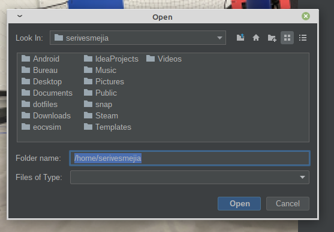

# What are workspaces?

## Introduction

A workspace basically consists of a folder containing `.java` source files and resource files, which are compiled on-the-fly by EOCV-Sim. This removes the need of having to use Gradle for running slow builds, and even allows you to see code changes in real time within a few seconds, or even milliseconds!

## Using workspaces (without any supported IDE or text editor)

Workspaces in EOCV-Sim are very flexible, which means that you don't need any specific IDE or text editor, you just need to provide `.java` files that the simulator will compile. There's an `eocvsim_workspace.json` file which configures the build process, and will be explained next.

The simulator creates and selects by default a workspace in the user folder, `~/.eocvsim/default_workspace`, which contains a sample GrayscalePipeline.java that is compiled and added on runtime, but you can change it by doing the following steps:

* Go under the "Pipelines" section, click the "Workspace" and finally "Select workspace". Or alternatively, you can also go to Workspace -> Select workspace

* Select a folder in the file explorer that pops up

* And you are done! The sim should select the folder as a workspace, create a `eocvsim_workspace.json` file if it doesn't exist in the selected folder, and build the `.java` files in the directory.
