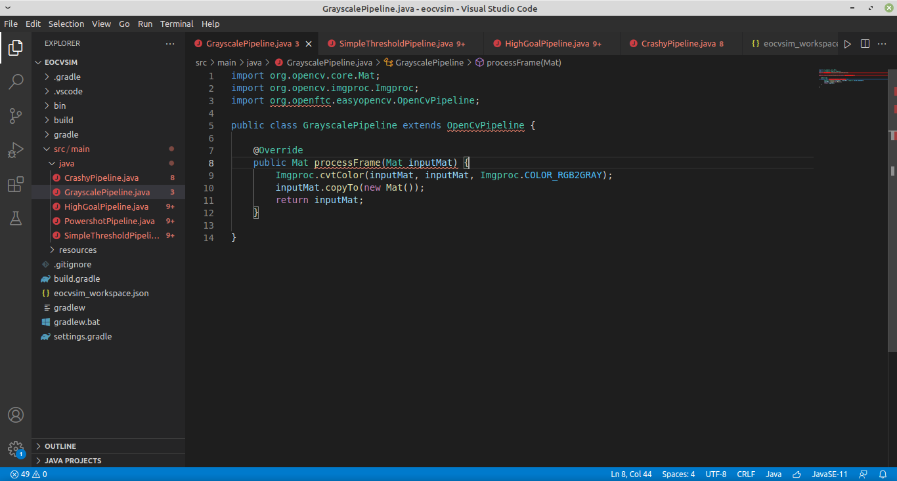

# What are workspaces?

## Introduction

A workspace basically consists of a folder containing `.java` source files and resource files, which are compiled on the fly by EOCV-Sim. This removes the need of having to use Gradle for running slow builds, and even allows to see code changes in real time within a few seconds or even milliseconds!

Note that the sim needs to be executed in a Java Development Kit \(JDK\) for using this feature, since Java Runtime Environments \(JREs\) don't come with a compiler packaged. Make sure you are using the correct Java version when executing the `EOCV-Sim-X.X.X-all.jar` file!

## Using workspaces \(without any supported IDE or text editor\)

Workspaces in EOCV-Sim are very flexible, which means that you don't need any specific IDE or text editor, you just need to provide `.java` files that the simulator will compile. There's a `eocvsim_workspace.json` file which configures the build process, and will be explained next.

The simulator creates and selects by default a workspace in the user folder, `~/.eocvsim/default_workspace`, which contains a sample GrayscalePipeline.java that is compiled and added on runtime, but you can change it by doing the following steps:

* Go under the "Pipelines" section, click the "Workspace" and finally "Select workspace". Or alternatively, you can also go to Workspace -&gt; Select workspace

* Select a folder in the file explorer that pops up

* And you are done! The sim should select the folder as a workspace, create a `eocvsim_workspace.json` file if it doesn't exist in the selected folder, and build the `.java` files in the directory.

